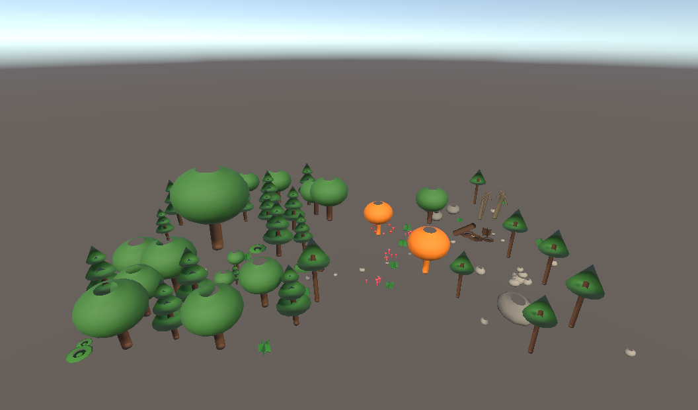

# TP3 - Composition d'une forêt structurée avec OpenUSD

ST2SNE, Efrei Paris 2025-2026 — Anil BRAUN.

Scène de forêt construite intégralement avec des références OpenUSD vers des assets externes.



## Structure du dépôt

```
forest-openusd-tp3/
├── usda/
│   ├── Forest.usda            ← scène principale (références uniquement, 131 instances)
│   └── assets/                ← 14 assets .usda sources (un par type d'objet)
│       ├── TreePine.usda       TreeOak.usda      TreeBirch.usda    DeadTree.usda
│       ├── RockBig.usda        RockSmall.usda
│       ├── Bush.usda           Fern.usda          Flower.usda
│       ├── FallenLog.usda      Moss.usda          Mushroom.usda
│       ├── BirdNest.usda
│       └── Ground.usda
├── scripts/
│   ├── generate_assets.py     ← génère les 14 assets sources
│   └── generate_forest.py     ← compose Forest.usda via references
├── unity/
│   └── ForestProject/         ← projet Unity 6.x (URP), scène Assets/Scenes/Forest.unity
│       └── Assets/
│           ├── Editor/        ← ForestImporter.cs + ForestMaterialize.cs
│           ├── USD/           ← copie des .usda pour l'import Unity
│           ├── Scenes/Forest.unity
│           └── Materials/ForestGenerated/  ← 18 matériaux URP/Lit auto-générés
└── screenshots/
```

## Reproduire la génération des .usda

```bash
pip install usd-core
python scripts/generate_assets.py
python scripts/generate_forest.py
```

## Reproduire l'import Unity

> **Avertissement Windows** : ouvrir le projet depuis un chemin **sans accent**
> (`Spécifications` casse le file format detection du SDK Unity USD).
> Préférer `C:\Users\<vous>\Desktop\ForestProject\` ou similaire.

1. Cloner le repo et l'ouvrir avec Unity Hub : **Add → Add project from disk → `unity/ForestProject/`**
2. Quand Unity charge, ouvrir la scène `Assets/Scenes/Forest.unity`
3. Si la scène est vide, lancer :
   - **Tools → Forest → Import Forest.usda** (instancie la hiérarchie depuis Assets/USD/Forest.usda)
   - **Tools → Forest → Materialize** (peint les 373 MeshRenderers avec 18 matériaux URP/Lit)

## Composition de la scène

3 zones paysagères + un chemin sinueux :

| Zone | Contenu | Points d'intérêt |
|---|---|---|
| **Zone_Dense** | 16 pins + 10 chênes + 6 buissons + 5 fougères + 5 mousses + 3 jeunes pousses | **Patriarche** : chêne géant (scale 1.85) en cœur de zone |
| **Zone_Clearing** | 4 chênes/bouleaux périmètre + 4 chênes automne + 3 parterres de fleurs + 6 fougères + 8 champignons | **Fairy ring** + **bird nest perché** à 2,8 m |
| **Zone_Rocky** | 5 bouleaux + 4 grands rochers + 6 petits rochers + 3 arbres morts + 5 mousses + 3 fougères | **Cairn** (6 pierres empilées), **hollow log** (tronc + 3 mousses + 4 champignons + 1 fougère) |
| **Path** | 16 cailloux jalonnent un tracé sinusoidal | exclusion 1.8 m autour du chemin (pas d'arbres) |

**Variations locales** : `translate`, `rotateY`, `rotateZ` (tilt ±3° organique), `scale` (±20–40 %).

**Overrides de matériau** :
- 4 chênes automne (palette orange/jaune) dans la clairière
- 2 bouleaux variant écorce sombre
- 2 buissons fleuris (rose, blanc crème)

## Biodiversité

| Catégorie demandée | Min | Livré |
|---|---|---|
| Types d'arbres | 3 | **4** (Pine, Oak, Birch, DeadTree) |
| Types de rochers | 2 | **2** (RockBig, RockSmall) |
| Végétation basse | 3 | **3** (Bush, Fern, Flower) |
| Éléments du sol | 2 | **3** (Moss, FallenLog, Mushroom) |
| Vie animale | 1 | **1** (BirdNest) |
| Zones paysagères | 3 | **3** + chemin |

## Visualiser le `.usda` sans Unity

- **usdview** (Pixar OpenUSD) : `usdview usda/Forest.usda`
- **VS Code** + extension *USD Language Support* (coloration syntaxique)

## Principe technique : composition par référence

Aucun mesh n'est dupliqué dans `Forest.usda`. Chaque instance est un `Xform` avec :

```usda
def Xform "Pine_07" (
    prepend references = @./assets/TreePine.usda@</TreePine>
)
{
    float xformOp:rotateY = 142.3
    float3 xformOp:scale = (1.08, 1.08, 1.08)
    double3 xformOp:translate = (-6.31, 0, 4.52)
    uniform token[] xformOpOrder = ["xformOp:translate", "xformOp:rotateY", "xformOp:scale"]
}
```

Les overrides utilisent la même mécanique :

```usda
def Xform "AutumnOak_00" (
    prepend references = @./assets/TreeOak.usda@</TreeOak>
)
{
    over "Materials"
    {
        over "Mat_Foliage"
        {
            over "Surface"
            {
                color3f inputs:diffuseColor = (0.85, 0.45, 0.10)
            }
        }
    }
    ...
}
```
